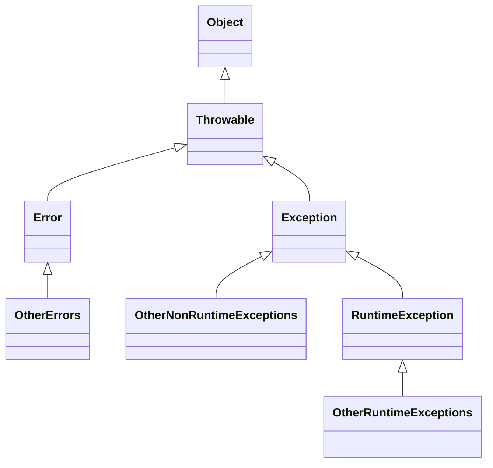

# Exceptions

_exception_: exceptional event



## The Catch or Specify Requirement

Valid Java programming language code must honor the Catch or Specify Requirement.
This means that code that might throw certain exceptions must be enclosed by either of the following:

- A try statement that catches the exception.
    The `try` must provide a handler for the exception,
    as described in Catching and Handling Exceptions.
- A method that specifies that it can throw the exception.
    The method must provide a `throws` clause that lists the exception,
    as described in Specifying the Exceptions Thrown by a Method.

Code that fails to honor the Catch or Specify Requirement will not compile.

Not all exceptions are subject to the Catch or Specify Requirement.

## The Three Kinds of Exceptions

1. Checked Exception (Catch or Specify)  
    e.g., `java.io.FileNotFoundException`

    Exceptions that are checked at compile time.
    All exceptions are checked exception,  
    **except** for those indicated by `Error`, `RuntimeException`, and their subclasses.
2. Errors (Unchecked Exception)  

    ```mermaid
    classDiagram
    Error <|-- OtherErrorExceptions
    class Error {
        + simpleName : String = java.lang.Error
    }
    ```

    e.g., `java.io.IOError`

    **Errors** are exceptional conditions that are external to the application,
    and that the application usually cannot anticipate or recover from.

    > Errors are not subject to the Catch or Specify Requirement.
    > Errors are those exceptions indicated by `Error` and its subclasses.
3. Runtime Exception (Unchecked Exception)  

    ```mermaid
    classDiagram
    RuntimeException <|-- OtherRuntimeExceptions
    class RuntimeException {
        + simpleName : String = java.lang.RuntimeException
    }
    ```

    e.g., `java.lang.NullPointerException`

    These are exceptional conditions that are internal to the application,
    and that the application usually cannot anticipate or recover from.
    These usually indicate **programming bugs**, such as logic errors or improper use of an API.

## Chained Exceptions

An application often responds to an exception by throwing another exception.
In effect, the first exception causes the second exception. 

### Methods and Constructors in `Throwable` That Support Chained Exceptions

```java
Throwable getCause()
Throwable initCause(Throwable)
Throwable(String, Throwable)
Throwable(Throwable)
```

The `Throwable` argument to `initCause()` and the `Throwable` constructors is the exception that
caused the current exception. `getCause()` returns the exception that caused the current exception, and initCause() sets the current exception's cause.

```java
try {

} catch (IOException e) {
    throw new SampleException("Other IOException", e);
}
```

In this example, when an IOException is caught,
a new SampleException exception is created with the original cause attached
and the chain of exceptions is thrown up to the next higher level exception handler.

## Accessing Stack Trace Information

> A _stack trace_ provides information on the execution history of the current thread
> and lists the names of the classes and methods that were called at the point
> when the exception occurred. A stack trace is a useful debugging tool that you'll normally
> take advantage of when an exception has been thrown.

The following code shows how to call the `getStackTrace()` method on the exception object.

```java
catch (Exception cause) {
    StackTraceElement elements[] = cause.getStackTrace();
    for (int i = 0, n = elements.length; i < n; i++) {
        System.err.println(elements[i].getFileName()
            + ":" + elements[i].getLineNumber() 
            + ">> "
            + elements[i].getMethodName() + "()");
    }
}
```

## Creating Exception Classes

You should write your own exception classes if you answer yes to any of the following questions;
otherwise, you can probably use someone else's.

- [ ] Do you need an exception type that isn't represented by those in the Java platform?
- [ ] Would it help users if they could differentiate your exceptions from those thrown
    by classes written by other vendors?
- [ ] Does your code throw more than one related exception?
- [ ] If you use someone else's exceptions, will users have access to those exceptions?
    A similar question is, should your package be independent and self-contained?
