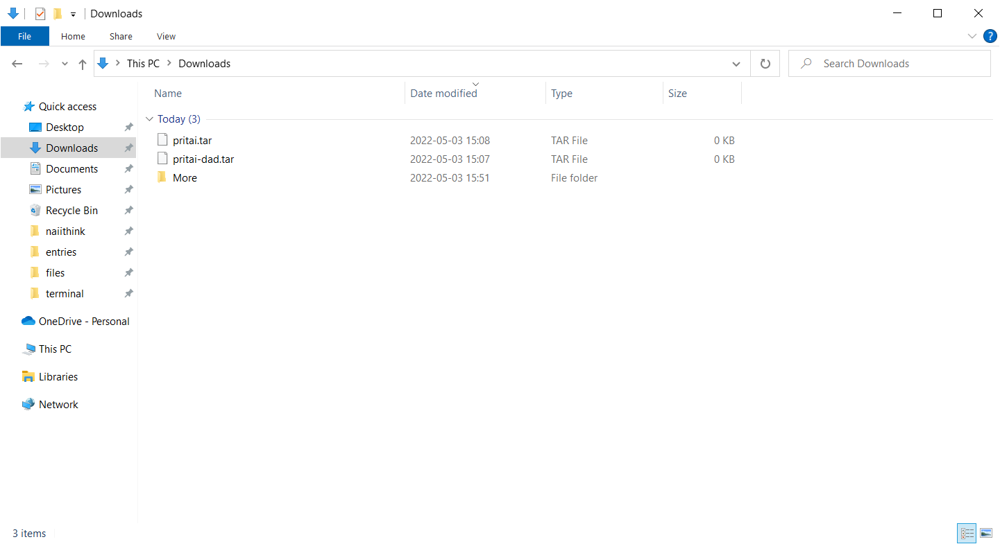
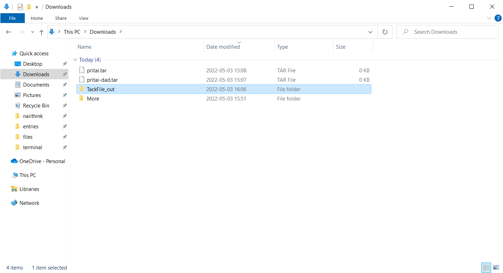
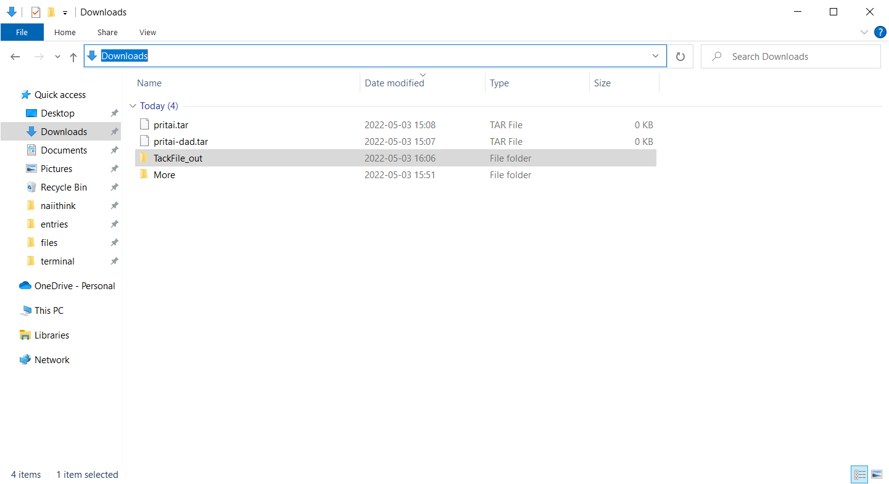
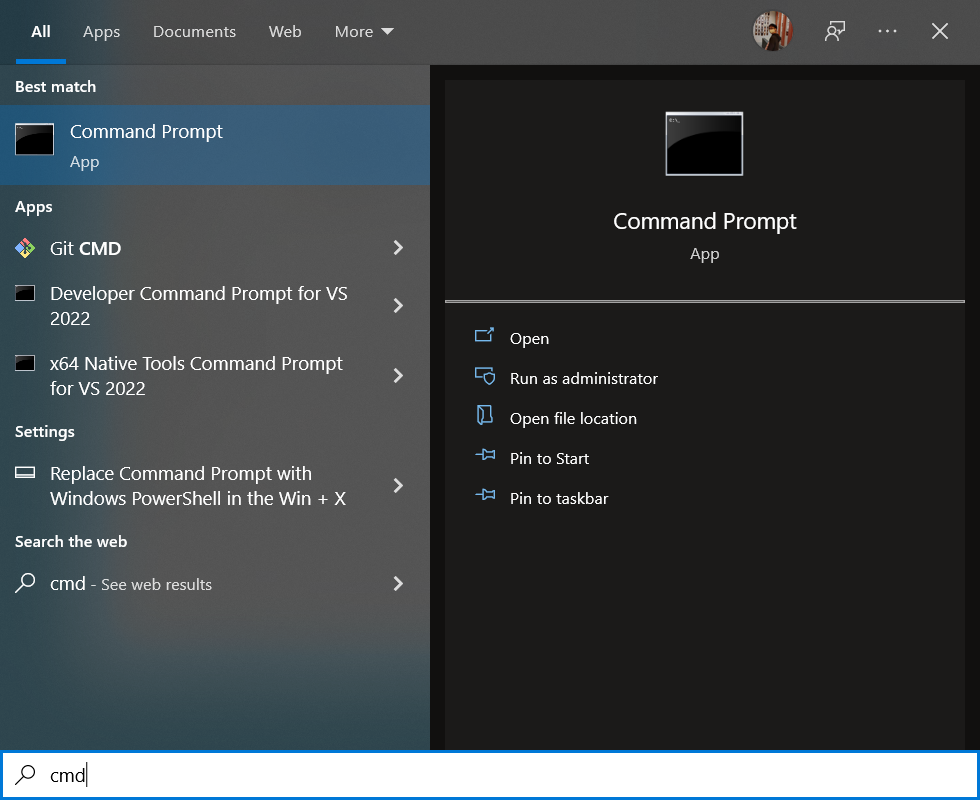
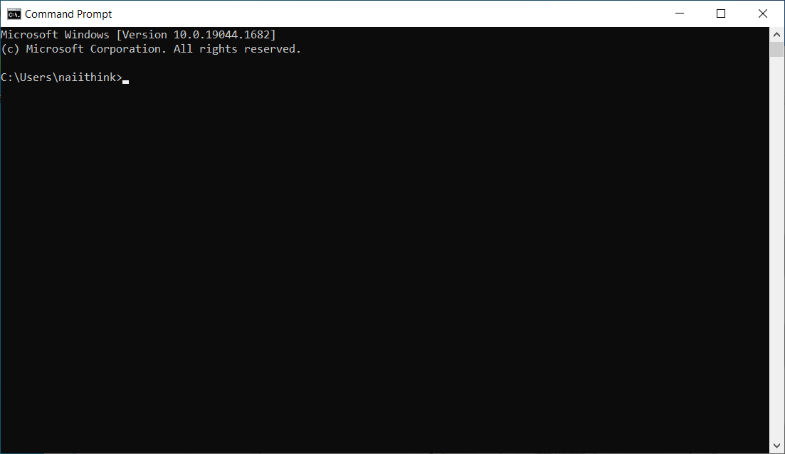
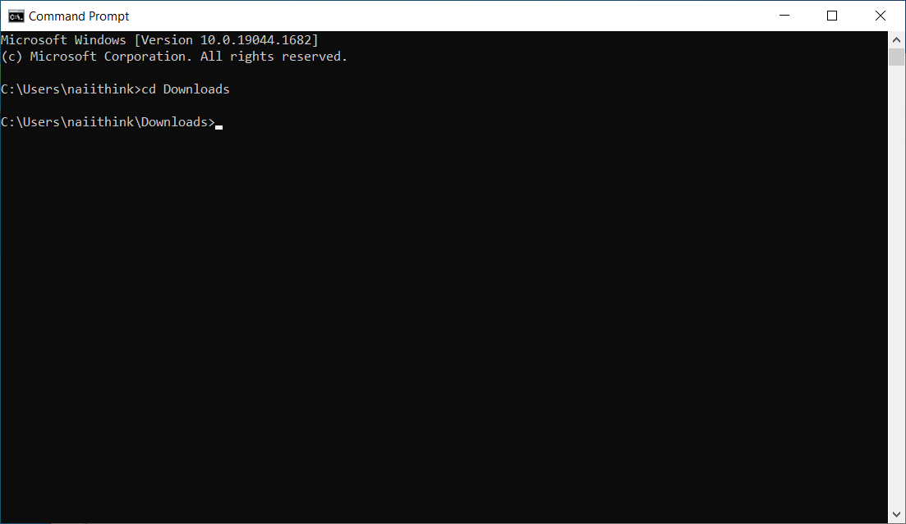
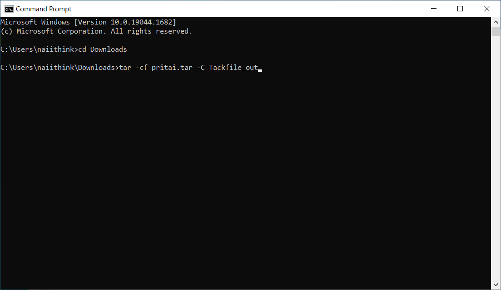
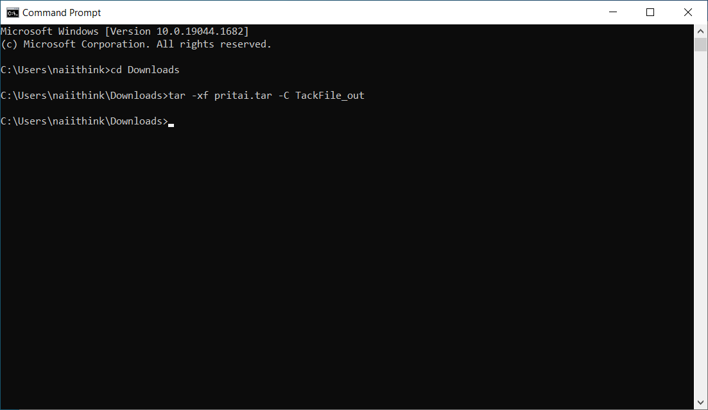

# แตกไฟล์

1. เข้าไปที่โฟล์เดอร์ที่ไฟล์อยู่  
    
1. สร้างโฟล์เดอร์ชื่อ `TackFile_out`
    
1. กด <kbd>ctrl + L</kbd> ตามด้วย <kbd>ctrl + C</kbd>  
    
1. เปิด Command Prompt  
    1. กดปุ่ม <kbd>&#x229E; (Windows)</kbd> แล้วพิมพ์ `cmd`  
        ถ้าขึ้นโปรแกรมแบบในรูปแล้ว กด <kbd>enter</kbd>
          
        จะต้องได้  
        
1. พิมพ์ตาม
    1. พิมพ์ `cd`
    1. เคาะ <kbd>space bar</kbd> 1 ที
    1. แล้ว <kbd>ctrl + V</kbd>
        
    1. <kbd>enter</kbd>
        
1. แตกไฟล์  
    1. ก็อปข้างล่างนี้ไปวาง (<kbd>ctrl + C</kbd>, <kbd>ctrl + V</kbd>)
        ```
        tar -xf pritai.tar -C TackFile_out
        ```
          
        แล้ว <kbd>enter</kbd>  
          
    1. เหมือนก่อนหน้าแต่ก็อปอันนี้ไปวางแทน
        ```
        tar -xf pritai-dad.tar -C TackFile_out
        ```