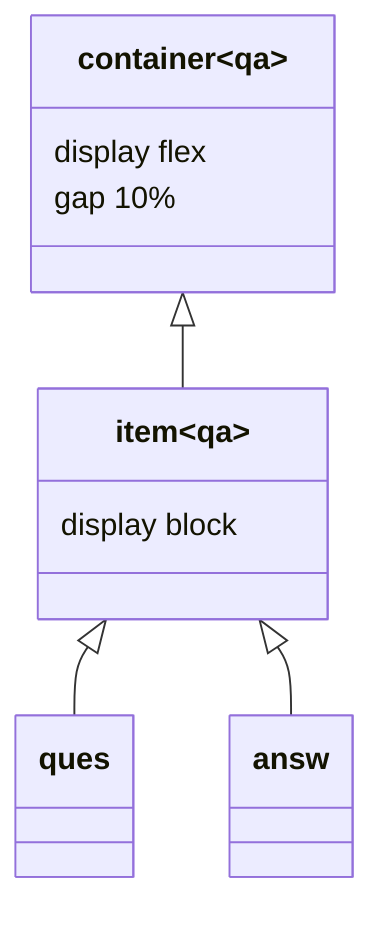

# Classes

```mermaid
classDiagram
    class container~qa~ {
        display flex
        gap 10%
    }
    class item~qa~ {
        display block
    }
    container~qa~ <|-- item~qa~
    item~qa~ <|-- ques
    item~qa~ <|-- answ

```

<!---->
